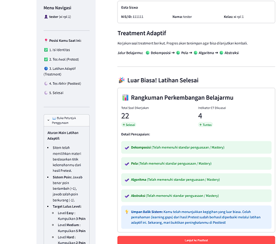
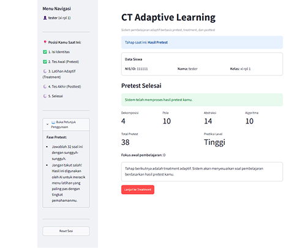
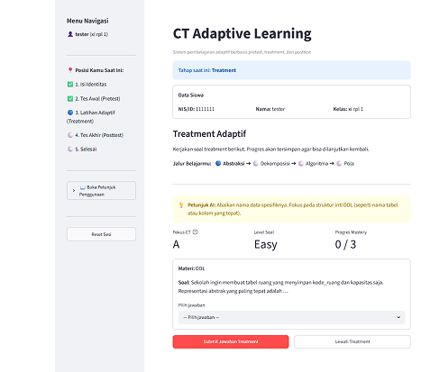

# CT Adaptive Learning System

A web-based adaptive learning system designed to assess and support students' Computational Thinking skills using machine learning and adaptive learning strategies.

**Live Demo:** https://ct-adaptive-learning.streamlit.app/

---

## Overview

CT Adaptive Learning System was developed as part of an undergraduate research project in Computer Science Education at Universitas Pendidikan Indonesia.

The system evaluates students' Computational Thinking abilities and classifies their proficiency using a K-Nearest Neighbors (KNN) model. Based on the assessment results, the application determines an adaptive learning path that focuses on each student's current proficiency level and weakest Computational Thinking indicator.

The application is designed for vocational high school students and integrates assessment, machine learning classification, adaptive practice, and learning progress tracking in a single web-based system.

---

## Application Preview

### Assessment and CT Classification

The system evaluates students across four Computational Thinking dimensions and uses the assessment results to determine their proficiency level and weakest CT indicator.



### Adaptive Learning Process

Learning activities are dynamically adjusted according to the student's CT profile, current difficulty level, mastery progress, and previous responses.



### Learning Progress Summary

At the end of the adaptive learning session, the system summarizes the student's progress and mastery across the Computational Thinking indicators.



---

## Key Features

### Computational Thinking Assessment

The system evaluates four Computational Thinking dimensions:

- Decomposition
- Pattern Recognition
- Abstraction
- Algorithmic Thinking

### Machine Learning Classification

A K-Nearest Neighbors (KNN) model is used to classify students into three Computational Thinking proficiency levels:

- Low
- Medium
- High

### Adaptive Learning

Learning activities are adjusted based on:

- The student's Computational Thinking proficiency level
- The weakest Computational Thinking indicator
- Student performance during the adaptive learning process

### Learning Workflow

The application follows a structured learning sequence:

```text
Student
   |
   v
Pretest
   |
   v
Computational Thinking Scoring
   |
   v
KNN Classification
   |
   v
CT Proficiency Level
   |
   v
Adaptive Learning
   |
   v
Posttest
   |
   v
Learning Results
```

### Data Persistence

Student information, learning sessions, and responses are stored using Supabase with PostgreSQL as the underlying database.

### Teacher Monitoring

The project also includes a monitoring interface for reviewing student learning progress and assessment results.

---

## Technology Stack

| Area | Technology |
| --- | --- |
| Programming Language | Python |
| Web Application | Streamlit |
| Machine Learning | Scikit-learn |
| ML Algorithm | K-Nearest Neighbors |
| Data Processing | Pandas, NumPy |
| Database | Supabase / PostgreSQL |
| Model Serialization | Joblib |
| Deployment | Streamlit Community Cloud |

---

## Machine Learning

The KNN model uses four Computational Thinking scores as input features:

| Feature | Description |
| --- | --- |
| `D_score` | Decomposition |
| `P_score` | Pattern Recognition |
| `A_score` | Abstraction |
| `Alg_score` | Algorithmic Thinking |

Each indicator has a score range of `0–14`.

The model predicts one of three Computational Thinking proficiency levels:

| Class | Level |
| --- | --- |
| 0 | Low |
| 1 | Medium |
| 2 | High |

The predicted level is then combined with the student's Computational Thinking profile to determine the appropriate adaptive learning path.

---

## System Architecture

```text
                    +------------------+
                    |     Student      |
                    +--------+---------+
                             |
                             v
                    +------------------+
                    |     Pretest      |
                    +--------+---------+
                             |
                             v
             +-------------------------------+
             | Computational Thinking Scores |
             | D | P | A | Alg               |
             +---------------+---------------+
                             |
                             v
                    +------------------+
                    |    KNN Model     |
                    +--------+---------+
                             |
                             v
              +----------------------------+
              | CT Proficiency Prediction  |
              | Low | Medium | High        |
              +-------------+--------------+
                            |
                            v
             +-----------------------------+
             | Adaptive Learning Engine    |
             |                             |
             | - CT proficiency level      |
             | - Weakest CT indicator      |
             | - Student performance       |
             +-------------+---------------+
                           |
                           v
                  +------------------+
                  | Adaptive Practice|
                  +--------+---------+
                           |
                           v
                  +------------------+
                  |     Posttest     |
                  +--------+---------+
                           |
                           v
                +----------------------+
                | Learning Results     |
                +----------+-----------+
                           |
                           v
               +-----------------------+
               | Supabase / PostgreSQL |
               +-----------------------+
```

---

## Project Structure

```text
ct-adaptive-learning/
│
├── app.py
├── app2.py
├── utils.py
│
├── dataset_ct_240_balanced.csv
├── knn_ct_meta.json
│
├── models/
│
├── requirements.txt
├── README.md
│
└── mlctskripsi.ipynb
```

### Main Files

**`app.py`**  
Main Streamlit application used for the student learning process.

**`app2.py`**  
Supporting monitoring interface used to review student learning data and progress.

**`utils.py`**  
Contains utility functions used by the application, including database-related operations.

**`mlctskripsi.ipynb`**  
Notebook used during the machine learning development and experimentation process.

**`dataset_ct_240_balanced.csv`**  
Dataset used during the machine learning model development process.

**`knn_ct_meta.json`**  
Contains metadata related to the KNN model.

---

## Running Locally

Clone the repository:

```bash
git clone https://github.com/mialfatih/ct-adaptive-learning.git
cd ct-adaptive-learning
```

Install the required dependencies:

```bash
pip install -r requirements.txt
```

Run the application:

```bash
streamlit run app.py
```

---

## Configuration

The application uses Supabase for database services.

Supabase credentials are not included in this repository for security reasons.

To run the project locally, configure your Supabase credentials using Streamlit's secrets configuration.

Create the following file:

```text
.streamlit/secrets.toml
```

Then configure the required Supabase credentials according to your own Supabase project.

Credentials and private keys should never be committed to the public repository.

---

## Research Context

This system was developed as part of research in Computer Science Education, with a focus on applying adaptive learning to Computational Thinking education for vocational high school students.

The research explores how student assessment results, machine learning classification, and adaptive learning strategies can be combined to provide a more personalized learning experience.

The system was implemented in the context of database learning materials, including:

- Data Definition Language (DDL)
- Data Manipulation Language (DML)
- Data Control Language (DCL)

---

## Live Application

The deployed application is available at:

https://ct-adaptive-learning.streamlit.app/

---

## Author

**Muhammad Izzuddin Al Fatih**

Computer Science Education  
Universitas Pendidikan Indonesia

GitHub: https://github.com/mialfatih
